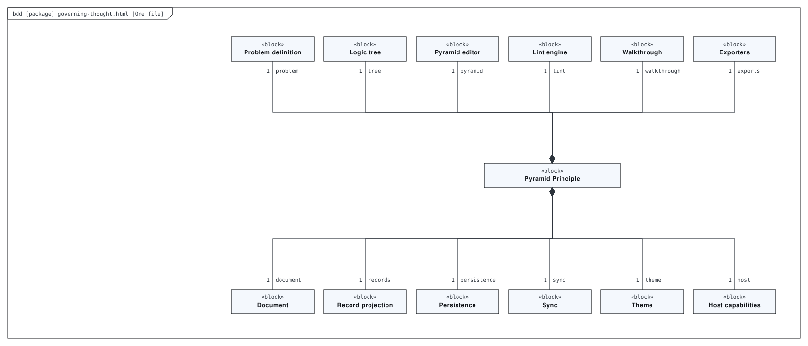
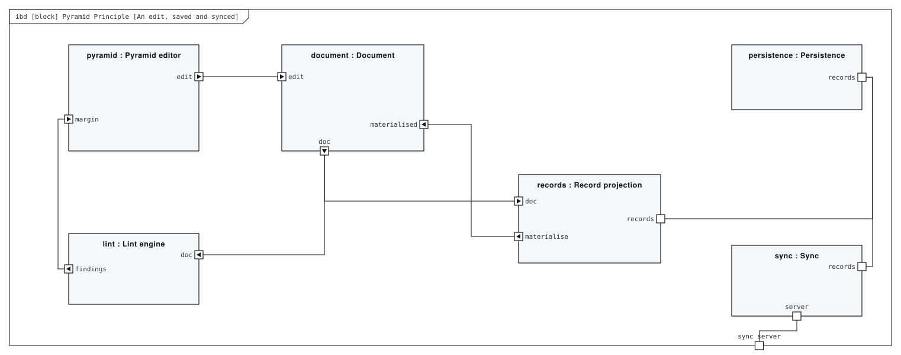
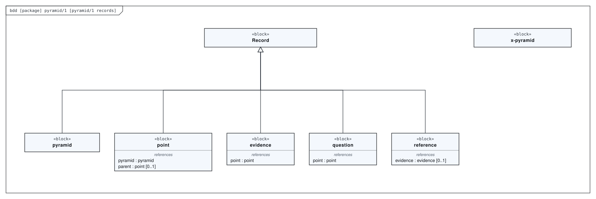
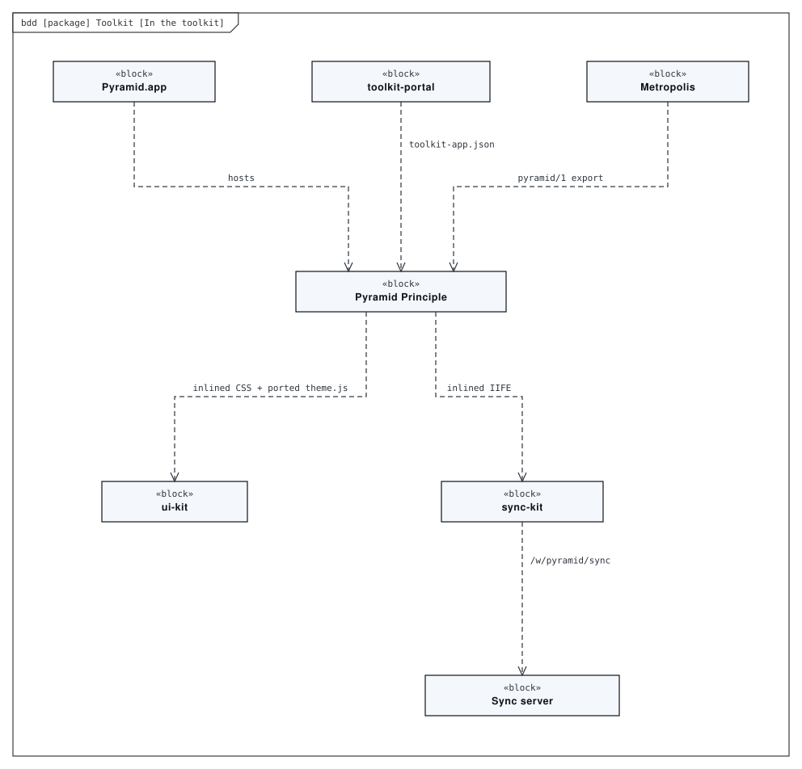
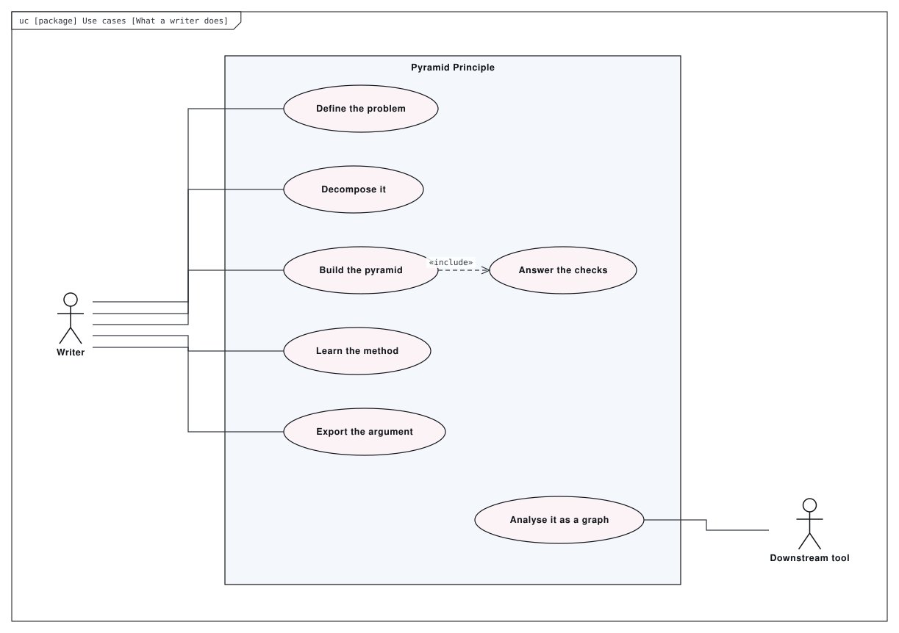
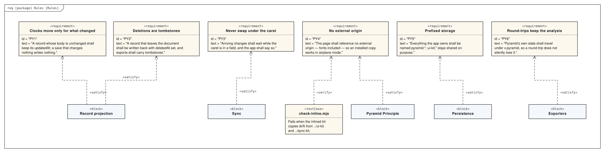

# Architecture

A guided workbench for Barbara Minto’s Pyramid Principle: define a problem with the R1/R2 gap framework, decompose it into a tested why/how tree, promote what survives into a governing thought and key line, run 26 structural checks, and export it as prose or as a typed graph. The whole application is one HTML file with ui-kit, sync-kit and its fonts inlined. The editor works on a nested document, while the store works on `pyramid/1` records whose clocks are set by diffing. A standalone Swift app wraps the same file, and the Portal serves it at `/pyramid/`.

This directory holds a SysML model of the repository, made with [SysML Modeler](https://github.com/allenxhsu/sysml-modeler).
`architecture.sysml.json` is the source: open it with **File ▸ Open** in the modeler to edit it, and re-export the SVGs from there.
The SVGs below are exports of it. The model passes the modeler's checks with 0 errors and 5 warnings.

## One file

*Block definition diagram* of **governing-thought.html**. The whole application, one file, no build step: structure, the deterministic lint engine, the graph export, everything — and inlined copies of ui-kit, sync-kit and six font families, so it references no external origin.

## An edit, saved and synced

*Internal block diagram* of **Pyramid Principle**. Served as a file, by python -m http.server, inside the Mac app, or at /pyramid/ on the Portal.

## pyramid/1 records

*Block definition diagram* of **pyramid/1**. The store works on records, one per pyramid, point, evidence item, question and reference.

## In the toolkit

*Block definition diagram* of **Toolkit**.

## What a writer does

*Use case diagram* of **Use cases**.

## Rules

*Requirement diagram* of **Rules**.

## Generated views

Computed from the model each time it is opened in the modeler:

- **Rules, as a table** — requirement table
